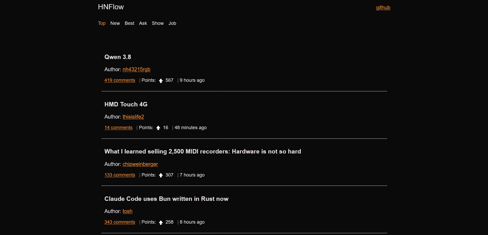
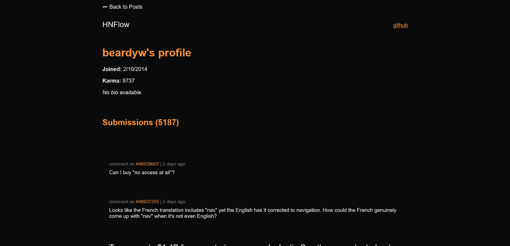
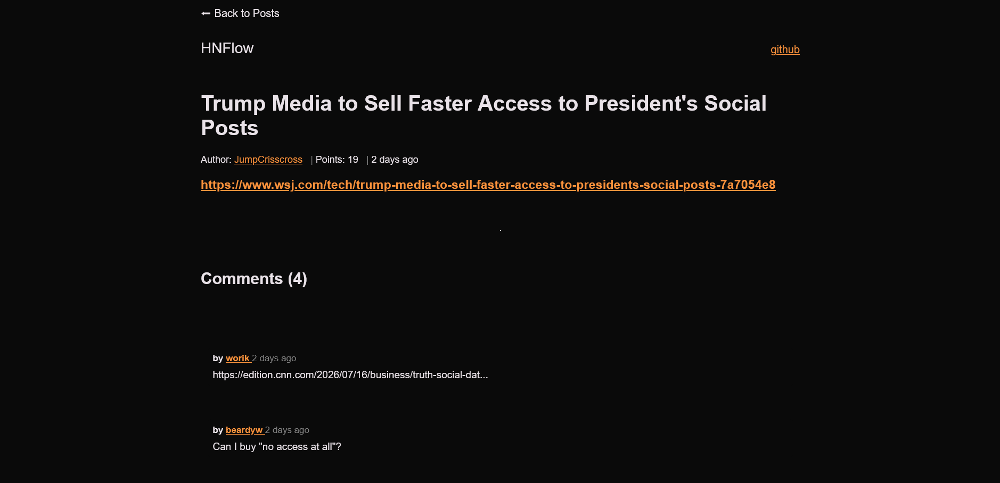

<p align="center">
  
</p>

# HNFlow

HNFlow is a Hacker News client built with vanilla HTML, CSS, and JavaScript. It consumes the official Hacker News Firebase API to provide a clean interface for browsing stories, reading discussions, and viewing user profiles.

## Screenshots

| Home | Comments | User Profile |
|------|----------|--------------|
|  |  |  |


## Features

- Browse Top, New, Best, Ask, Show, and Job stories
- View story metadata including score, author, comment count, and submission time
- Read nested comment threads with collapsible replies
- Lazy loading for comment threads
- User profile pages with karma, account information, and recent submissions
- Client-side pagination for story lists
- Responsive dark theme
- No frameworks or libraries

## Tech Stack

- HTML5
- CSS3
- JavaScript (ES6+)
- Hacker News Firebase API
- Intersection Observer API

## Project Structure

```
.
├── assets/
├── css/
├── js/
├── comments.html
├── users.html
└── index.html
```

## Acknowledgements

This project was inspired by:

- OneSem by Namishh: https://onesem.namishh.com/
- GitHub: https://github.com/namishh

It is also inspired by the Hacker News client Hacknio:

- Live Demo: https://hacknio.vercel.app/
- GitHub: https://github.com/ni5arga/hacknio

While inspired by these projects, HNFlow is an independent implementation built from scratch using vanilla HTML, CSS, and JavaScript.

## Author

GitHub: https://github.com/git-notion


## Running Locally

Clone the repository:

```bash
git clone https://github.com/git-notion/hackernews-frontend.git
cd hackernews-frontend
```

Start a local server.

Using VS Code Live Server:

- Right-click `index.html`
- Select **Open with Live Server**

Or with Python:

```bash
python -m http.server
```

Then open:

```
http://localhost:8000
```

## API

This project uses the official Hacker News Firebase API and the Intersection Observer API.<br>
https://github.com/HackerNews/API <br>
https://developer.mozilla.org/en-US/docs/Web/API/Intersection_Observer_API


## License

MIT
